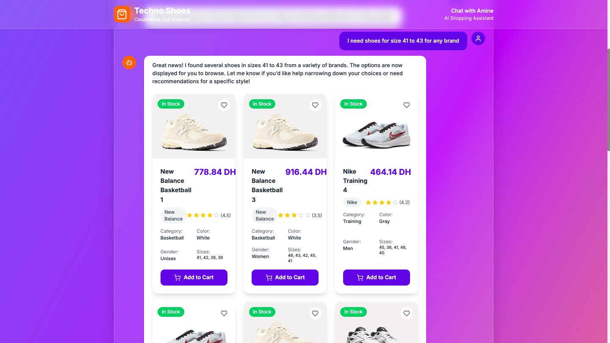

# Techno Shoe AI Agent 🦾👟

A smart ecommerce platform featuring **Amine**, an AI-powered shopping assistant that helps customers find the perfect shoes through natural conversation. Built with modern web technologies and deployed for seamless shopping experience.

## 🌟 Live Demo

**[Visit Techno Shoe AI Agent](https://techno-shoe-ai-agent.vercel.app/)**

## 🖼️ Project Preview

<table>
  <tr>
    <td width="50%">
      
      <p style="text-align:center"><em>Welcome Screen - Meet Amine</em></p>
    </td>
    <td width="50%">
      
      <p style="text-align:center"><em>AI-Powered Search Results</em></p>
    </td>
  </tr>
</table>

## 🚀 Features

### 🤖 AI Shopping Assistant (Amine)
- **Natural Language Processing**: Chat with Amine to find shoes using everyday language
- **Smart Product Search**: AI understands preferences and filters products accordingly
- **Personalized Recommendations**: Get tailored suggestions based on your needs
- **Size & Availability Checker**: Real-time inventory management
- **Customer Information Management**: Secure storage of customer details for reservations

### 👟 Product Catalog
- **Premium Brands**: Nike, Adidas, Puma, Reebok, New Balance
- **Multiple Categories**: Running, Basketball, Casual, Training
- **Color Options**: Black, White, Red, Blue, Gray
- **Size Range**: European sizes (36-47)
- **Gender Specific**: Men, Women, Unisex options

### 💬 Interactive Experience
- **Real-time Chat Interface**: Smooth conversation flow with Amine
- **Visual Product Display**: Beautiful shoe galleries with images
- **Instant Reservation**: Quick booking system with customer info collection
- **Mobile Responsive**: Optimized for all devices

## 🛠️ Tech Stack

### Frontend
- **React** (Vite) - Fast and modern development
- **Tailwind CSS** - Utility-first styling
- **Responsive Design** - Mobile-first approach

### Backend
- **Flask** (Python) - Lightweight web framework
- **OpenAI GPT-4.1** - Advanced language model for AI agent
- **MongoDB** - NoSQL database for flexible data storage
- **RESTful API** - Clean and organized backend architecture

### Deployment
- **Vercel** - Frontend and backend hosting
- **MongoDB Atlas** - Cloud database hosting

## 📁 Project Structure

```
Techno_Shoe_AIAgent/
├── frontend/                 # React frontend
│   ├── src/
│   ├── public/
│   ├── package.json
│   └── vite.config.js
├── backend/                  # Flask backend
│   ├── server.py            # Main server file
│   ├── requirements.txt     # Python dependencies
│   ├── database/           # Database initialization
│   │   └── init_db.py      # Seed database with fake data
│   └── tests/              # AI agent testing
└── README.md
```

## 🎯 How It Works

1. **Customer Interaction**: Users chat with Amine about their shoe preferences
2. **AI Processing**: GPT-4.1 processes natural language and determines search criteria
3. **Database Query**: MongoDB is searched based on AI-interpreted parameters
4. **Product Display**: Frontend beautifully renders matching shoes with images
5. **Reservation System**: Interested customers provide contact info for shoe reservation
6. **Data Storage**: Customer information and preferences stored securely

## 🔧 Installation & Setup

### Prerequisites
- Node.js (v16+)
- Python (v3.8+)
- MongoDB instance
- OpenAI API key

### Frontend Setup
```bash
cd frontend
npm install
npm run dev
```

### Backend Setup
```bash
cd backend
pip install -r requirements.txt
python server.py
```

### Environment Variables
Create `.env` file in backend directory:
```env
GITHUB_TOKEN=your_openai_api_key
CONNECTION_STRING=your_mongodb_connection_string
DB_NAME=techno_shoes
```

### Database Initialization
```bash
cd backend/database
python init_db.py
```

## 🎨 Key Features Deep Dive

### AI Agent Capabilities
- **Context Awareness**: Remembers conversation history
- **Multi-parameter Search**: Handles complex queries (brand + color + size + budget)
- **Availability Checking**: Real-time stock verification
- **Customer Profiling**: Builds customer preferences over time

### Frontend Excellence
- **Conversational UI**: Chat-like interface for natural interaction
- **Product Galleries**: Responsive image grids with hover effects
- **Loading States**: Smooth transitions and feedback
- **Error Handling**: Graceful error messages and fallbacks

### Backend Architecture
- **Tool-based AI**: Structured function calls for database operations
- **Session Management**: Maintains conversation state
- **Data Validation**: Robust input sanitization
- **API Security**: CORS configuration and error handling

## 🔍 API Endpoints

- `POST /api/chat` - Main chat endpoint for AI interaction
- `GET /api/health` - Health check endpoint

## 📊 Database Schema

### Shoes Collection
```javascript
{
  name: String,
  brand: String,
  category: String,
  price: Number,
  color: String,
  gender: String,
  sizes: [Number],
  in_stock: Boolean,
  rating: Number,
  image_url: String
}
```

### Customers Collection
```javascript
{
  first_name: String,
  last_name: String,
  age: Number,
  phone: String,
  interested_products: [String],
  conversation_history: [Object],
  created_at: Date
}
```

## 🎪 Demo Scenarios

Try these conversations with Amine:
- "I need black Nike running shoes size 42"
- "Show me casual shoes under 500 DH"
- "What Adidas shoes do you have for women?"
- "I want to reserve the blue sneakers"

## 🔮 Future Enhancements

- **Voice Integration**: Voice-to-text for hands-free shopping
- **Image Search**: Upload shoe photos for similar product finding
- **Payment Integration**: Complete checkout process
- **Multi-language Support**: Arabic and French language options
- **Inventory Management**: Admin panel for stock management

## 🤝 Contributing

This is a personal learning project and is not currently accepting contributions.

## 📝 License

This project is for educational and learning purposes only. All rights reserved.

## 🙏 Acknowledgments

- OpenAI for GPT-4.1 language model
- MongoDB for flexible data storage
- Vercel for seamless deployment
- The open-source community for amazing tools and libraries

---

**Built with ❤️ in Casablanca, Morocco**

*Experience the future of shoe shopping with AI-powered assistance!*
